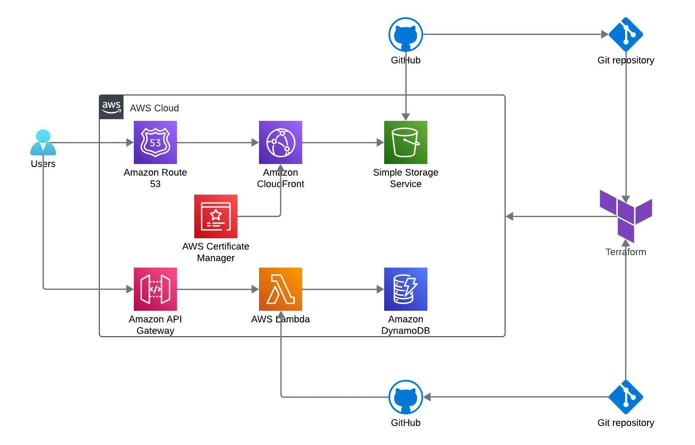

# Cloud Resume Challenge

**Frontend repository** of *[resume.amitmehta.cloud](https://amitmehta.cloud)*

This project is inspired by the [Cloud Resume Challenge](https://cloudresumechallenge.dev/) and showcases my resume using modern cloud services and best practices in web development and deployment.

## Website
Check out the live website [here](https://amitmehta.cloud)

## Architecture Diagram

## Frontend

The frontend code for my resume is built with **HTML**, **CSS**, and **JavaScript**. The resume is hosted on **AWS S3**, served via **CloudFront** for CDN, and accessible through a custom domain managed by **Route 53**.

### Architecture

- **HTML & CSS:** For the content and style of the resume.
- **JavaScript:** For dynamic functionality, including calling the backend for the view counter functionality.
- **AWS S3:** Static website hosting.
- **CloudFront:** Content Delivery Network (CDN) for global distribution.
- **Route 53:** Manages the DNS for the custom domain.
- **AWS Certificate Manager:** Creates a public certificate for CloudFront to enable HTTPS.
- **Terraform:** Infrastructure as Code (IaC) to provision and manage AWS resources. Remote backend is set up in S3 and DynamoDB is used for state locking.
- **AWS SSM Parameter Store:** Used to securely store and manage secrets.
- **GitHub Actions:** Automates the CI/CD pipeline to deploy changes to the S3 bucket after every commit.

## Backend

The backend handles the view counter functionality, updating and retrieving the number of times the page has been accessed. It is written in **Python** and hosted on **AWS Lambda**, triggered via **API Gateway**. Data is stored in **Dynamo DB** table.

### Architecture

- **API Gateway:** Receives requests from the frontend.
- **Lambda Function:** Triggered by API Gateway, written in Python.
  - Interacts with **DynamoDB** to fetch the view count.
  - Returns the view count to the JavaScript in the frontend.
- **DynamoDB:** Stores the view count.
- **AWS SSM Parameter Store:** Stores and manages secrets securely.
- **Terraform:** Infrastructure as Code (IaC) to provision and manage AWS resources. Remote backend is set up in S3 and DynamoDB is used for state locking.
- **GitHub Actions:** Automates the CI/CD pipeline to deploy changes to the Lambda Function after every commit.

#### How it Works

1. **JavaScript** on the frontend calls the **API Gateway**.
2. **API Gateway** triggers a **Lambda function**.
3. The **Lambda function**, written in Python, interacts with **DynamoDB** to fetch the view count.
4. The view count is returned to the frontend and displayed to the user.

## CI/CD Pipeline

The CI/CD pipeline is configured using **GitHub Actions** to automate the deployment process. Every commit to the `main` branch triggers the workflow defined in `.github/workflows/deploy.yml`, which:
- **Checks out the repository.**
- **Syncs the content to the S3 bucket.**
- **Invalidates the CloudFront cache** to ensure changes are reflected immediately.

---
